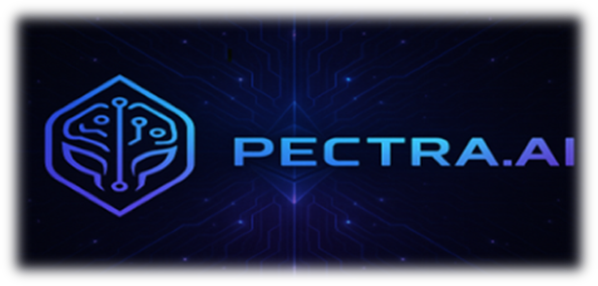

  

# Pectra.ai

**AI + UX for Ethereum’s Next Era**  
Design-forward, community-powered tools to enhance user experience during Ethereum’s Pectra upgrade cycle.

🚀 [**Live Demo**](https://pectra-ai.netlify.app) ← _Update this once deployed on Netlify_

---

## 🧪 What We’re Building

**Pectra.ai** is a community-led initiative exploring how **AI** and **user-first design** can redefine Ethereum interactions in 2025.

🛠️ **Current Toolkit**  
- `AI Wallet Walkthrough Generator` – Contract wallet onboarding
- `Onboarding Simulation Engine` – Dev UX testbench
- `UX Audit Toolkit` – AI + heuristics for dApp reviews
- `Community UX Portal` – Submit/vote on design experiments

---

## 💡 Protocol Purpose

We believe Ethereum’s experience layer should be:
- **Human-centered** 🧠
- **Transparent** 🔍
- **AI-Enhanced** 🤖  
Our tools help developers ship more intuitive dApps that anyone can use.

---

## 🛠️ Tech Stack

| Frontend | Deployment | Design |
|----------|-------------|--------|
| HTML/CSS | Netlify     | Figma/Canva |
| JavaScript (optional) | GitHub | AI-powered UX heuristics |

---

## 🌐 Live Deployment

The site is deployed using [**Netlify**](https://www.netlify.com/) for easy version control with GitHub.

> 🌐 **Netlify URL**: _Add it once deployed_  
> 🔗 **Custom Domain**: [pectra.ai](https://pectra.ai) ← once connected

---

## 🧠 Community + UX Focus

We’re inviting a small cohort of:
- Ethereum UX designers
- AI researchers
- Web3 builders

...to co-create with us. Interested? [Join the Waitlist](#)

---

## 🪪 License

This project is licensed under the MIT License.

---

  Built with ❤️ by the Pectra.ai Community

